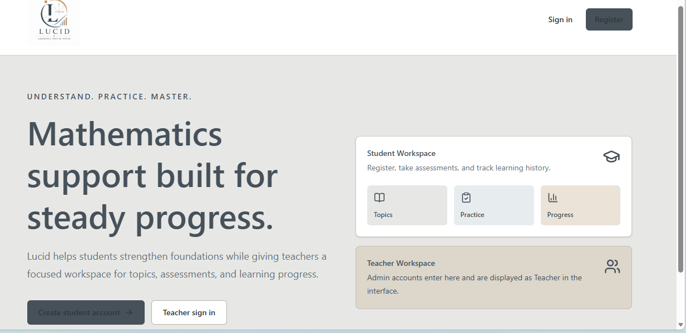
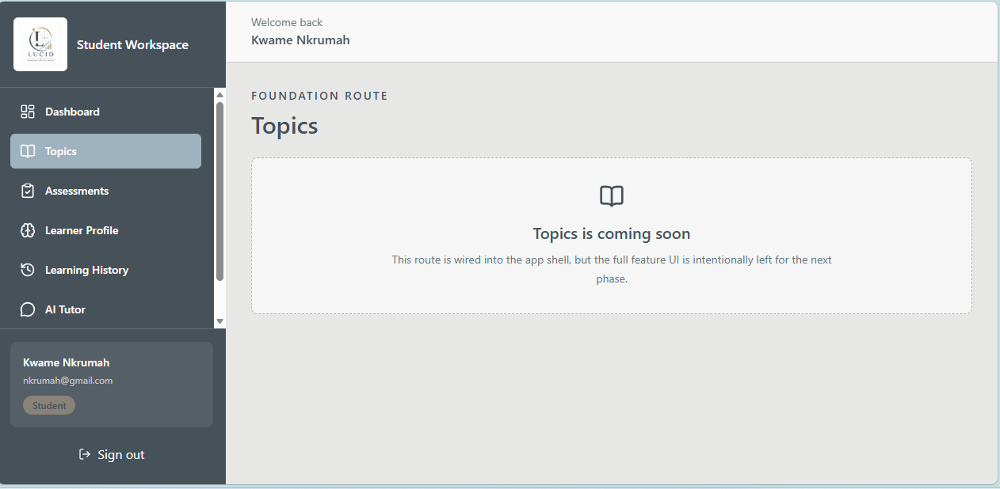

# Lucid Math

Lucid Math is a focused mathematics learning platform for Ghanaian students and the teachers guiding their progress. The system combines a React frontend, an ASP.NET Core backend, PostgreSQL data storage, authentication, assessments, learner profiles, and progress tracking.

The product goal is to help learners strengthen foundations through structured topics, diagnostic practice, assessment history, and adaptive recommendations. The AI tutor experience is part of the planned direction, while the current build focuses on the authenticated learning workspace and backend data flow.

## Work Completed So Far

### Frontend

- Built the public landing page with clear student and teacher entry points.
- Built student registration and sign-in screens connected to the backend authentication API.
- Added protected student and teacher application shells.
- Added student navigation for Dashboard, Topics, Assessments, Learner Profile, Learning History, AI Tutor, and Settings.
- Added student assessment screens for listing assessments, taking an assessment, and viewing results.
- Added learner profile and learning history screens.
- Wired frontend services to the backend API through a shared Axios client.
- Added environment-based API configuration through `VITE_API_BASE_URL`.

### Backend

- Built an ASP.NET Core Web API using a layered structure:
  - `MathTutor.Domain`
  - `MathTutor.Application`
  - `MathTutor.Infrastructure`
  - `MathTutor.API`
- Added PostgreSQL persistence with Entity Framework Core.
- Added Identity-based users, roles, registration, and login.
- Added JWT authentication for protected API routes.
- Added student, topic, question, assessment, learner profile, learning history, dashboard, and admin assessment endpoints.
- Added database seeding for development roles, admin user, topics, and sample questions.
- Added health endpoints for API and PostgreSQL status checks.

### Database And Deployment Preparation

- Created and applied EF Core migrations:
  - `20260715221842_InitialCreate`
  - `20260726225102_AddQuestionOptions`
  - `20260726230250_CompleteAssessmentProfileHistoryMvp`
- Confirmed migrations were applied to the Azure PostgreSQL database.
- Published the backend locally in Release mode.
- Created a deployable backend ZIP artifact at `backend/lucid-api.zip`.
- Cleaned the repository by ignoring generated build and deployment artifacts such as `bin/`, `obj/`, `backend/publish/`, and backend ZIP files.

## Current Screenshots

### Landing Page



### Sign In


### Student Registration


### Student Workspace



## Technology Stack

### Frontend

- React
- TypeScript
- Vite
- Tailwind CSS
- Axios
- React Router

### Backend

- C#
- ASP.NET Core Web API
- Entity Framework Core
- ASP.NET Core Identity
- JWT Bearer authentication

### Database

- PostgreSQL
- Azure Database for PostgreSQL

### Deployment Target

- Azure App Service for the backend API
- Azure PostgreSQL for production data

## Running Locally

### Backend

From the `backend` folder:

```powershell
dotnet tool restore
dotnet ef database update --project MathTutor.Infrastructure --startup-project MathTutor.API --context ApplicationDbContext
dotnet run --project MathTutor.API --urls http://localhost:5152
```

### Frontend

From the `frontend` folder:

```powershell
npm install
npm run dev
```

The frontend expects an API base URL in `frontend/.env`:

```env
VITE_API_BASE_URL=http://localhost:5152/api
```

## Deployment Progress

The backend has been published and packaged locally. Azure CLI was installed, but Azure sign-in could not be completed because the account used did not have access to the required Azure subscription/resource group.

The remaining deployment steps are:

```powershell
az login
az account set --subscription "Azure subscription 1"
az webapp deploy --resource-group LucidMath --name lucid-behehsc0g0egdvgr --src-path .\backend\lucid-api.zip --type zip --clean true
az webapp restart --resource-group LucidMath --name lucid-behehsc0g0egdvgr
```

## Remaining Work

- Complete the Settings page.
- Complete the AI Tutor page and connect it to the chosen AI provider.
- Finish teacher workspace pages for topics, questions, assessments, students, analytics, and settings.
- Deploy the backend to Azure App Service after signing in with an Azure account that has access to the `LucidMath` resource group.
- Configure production environment variables securely in Azure App Service.
- Test the deployed API health endpoint and authentication routes.
